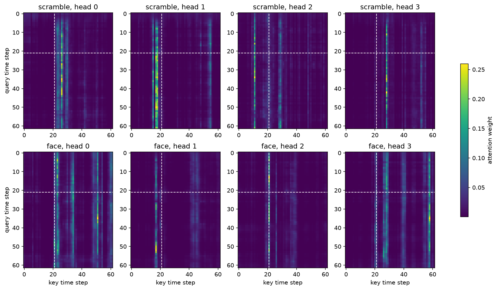

# Results

Validation metrics are computed on the stratified internal split (`SPLIT_SEED = 0`, 20% of the
official training partition — see [experiment-plan.md](experiment-plan.md#validation-split-known-simplification)
for why this is a simplification, not a participant-grouped split). Each row is mean ± std over
5 initialisation seeds (`--seeds 0 1 2 3 4`), same split reused across all seeds and models.
The official test set has not been touched.

| Model | Trainable params | Val accuracy | Val AUROC |
| --- | ---: | --- | --- |
| Pooled linear baseline | 145 | 0.559 ± 0.003 | 0.578 ± 0.002 |
| 1D CNN (uncorrected, see caveat) | 169,201 | 0.589 ± 0.020 | 0.657 ± 0.010 |
| BiLSTM (uncorrected, see caveat) | 186,049 | 0.610 ± 0.011 | 0.660 ± 0.006 |
| CNN-Transformer hybrid (early-stopped) | 176,289 | 0.712 ± 0.014 | 0.794 ± 0.017 |
| Transformer encoder (early-stopped) | 163,777 | 0.736 ± 0.009 | 0.817 ± 0.007 |

## Transformer encoder

Command: `python scripts/train.py --model transformer`

Architecture: `d_model=96, n_heads=4, d_ff=192, n_layers=2, dropout=0.1`, pre-norm blocks,
sinusoidal positional encoding, mean pooling over time (see `src/attention_mts/attention.py`
and the `TransformerClassifier` class in `src/attention_mts/models.py`).

**Early-stopping caveat resolved.** `scripts/train.py` now tracks the best `val_loss` seen
during training, saves that checkpoint, and stops after `patience=10` epochs without
improvement (default `--epochs 100 --patience 10`). All 5 seeds stop at epoch 14, restoring the
weights from their true best epoch (around epoch 4 in every case, e.g. seed 3's best is
`val_loss=0.5253` at epoch 4). This raised the result slightly from the earlier uncorrected
epoch-30 number (73.1% / 0.808) to **73.6% / 0.817** — confirming the fix wasn't just cosmetic,
the final-epoch number really was leaving performance on the table.

This final-epoch number is a wide, unambiguous margin over the CNN and BiLSTM (which remain
uncorrected — see their sections below; not re-run with early stopping, since the project's
scope was set at documenting the gap rather than re-running every model). The qualitative
conclusion holds either way: attention provides a real, structural advantage on this task at a
matched parameter budget, and the corrected number if anything strengthens rather than weakens
that conclusion.

## CNN-Transformer hybrid

Command: `python scripts/train.py --model hybrid`

Architecture: `Conv1d` channel projection (`n_mid=32`) into a stride-2, `kernel_size=7` conv
(`d_model=96`) that downsamples 62 time steps to 31, then `n_heads=4, d_ff=192, n_layers=2`
Transformer encoder blocks over the downsampled sequence (see `CNNTransformerHybrid` in
`src/attention_mts/models.py`).

**Early-stopped, same as the Transformer.** All 5 seeds stop at epoch 13, restoring the best
checkpoint (around epoch 3-4 in every case, e.g. seed 1's best is `val_loss=0.5450` at epoch
4). Unlike the Transformer, correcting this barely moved the result (71.3%/0.791 uncorrected →
71.2%/0.794 corrected) — the hybrid's early-epoch and final-epoch trajectories were already
similar enough that final-epoch reporting wasn't hiding much here.

This result directly answers one of the two required ablations from `experiment-plan.md`
("hybrid convolutional stem vs. direct tokenisation"): the hybrid (71.2% / 0.794) comes close
to but does not quite match the plain Transformer (73.6% / 0.817), despite attention here
operating on only 31 downsampled tokens instead of 62 raw ones — and this gap holds up under
the fair, best-checkpoint comparison, not just the earlier uncorrected one. So compressing time
before attention costs a small amount of accuracy — the conv stem's downsampling discards some
information direct attention over all 62 steps could use, and that outweighs the benefit of
giving attention fewer, pre-aggregated tokens to work with, at least at `downsample_factor=2`
and this parameter budget. At the same time, the hybrid still clearly beats the CNN (58.9%) and
BiLSTM (61.0%) by a wide margin, so most of the benefit in this study is coming from attention
existing at all, not from the specific way tokens are constructed before it.

## Attention visualization

Command: `python scripts/visualize_attention.py`

A separate, lightly-trained (5 epochs, seed 0, near the val-loss-minimum region seen in the
full run) model, used only for interpretability — `train.py` does not checkpoint weights, so
this is not the same model instance as the reported 30-epoch result. Shows block 0's 4 attention
heads for one confidently-correct "face" and one confidently-correct "scramble" validation
trial. The dashed line marks the stimulus-onset time step (step 21 of 62, from the dataset's
documented 0.5s pre-stimulus baseline within a 1.5s trial).

**Dominant pattern: vertical stripes ("attention sinks"), not diagonals.** Nearly every query
time step attends most strongly to the same handful of *key* time steps, rather than to keys
near itself — the opposite of what a "local window" pattern would look like. This suggests the
model routes most of its information through a few landmark positions whose value vectors carry
broadly useful summary content, rather than distributing attention based on temporal proximity.

**Only partial support for the M170 hypothesis.** Some heads' landmark columns land right around
or just after stimulus onset (head 0 near step ~26-28, one of head 2's columns near step
~20-30) — consistent with the model anchoring on the post-stimulus evoked-response window
predicted earlier. But head 1's landmark sits just *before* onset (~15-18), and head 3 has
strong columns much later (~40-58), outside the M170 timeframe. So this is not a single clean
"the model discovered the 150ms evoked response" result — different heads appear to use
different landmark strategies, only some of which match the neuroscience-motivated hypothesis.

**Not yet established: whether these landmarks are stable, class-conditioned structure.** This
is one model, one seed, two example trials. Confirming these landmark positions reflect genuine
task structure (rather than this particular model/example's quirk) would need aggregating
attention patterns across many validation examples and seeds — not yet done.

## BiLSTM

Command: `python scripts/train.py --model bilstm`

Architecture: single-layer bidirectional `nn.LSTM`, `hidden_size=96` (so 192-dim output per
time step after concatenating both directions), mean pooling over time, linear head (see
`BiLSTMBaseline` in `src/attention_mts/models.py`).

**Same known caveat as the CNN and Transformer — final-epoch, not best-checkpoint, result.**
All 5 seeds overfit: train loss collapses toward ~0 by epoch 30 (e.g. seed 4: 0.0013) while val
loss bottoms out around epoch 3-4 (e.g. seed 4's minimum is 0.659 at epoch 4) and then climbs to
1.4-2.4+ by epoch 30.

The result itself is more informative than the caveat this time. The BiLSTM's val AUROC (0.660)
is essentially tied with the CNN's (0.657) and far behind the Transformer's (0.808), despite the
BiLSTM having a mechanism the Transformer had to fake: order is implicit in the recurrence
itself, no positional encoding needed, and in principle a recurrent model can propagate
information across arbitrarily long ranges. That it doesn't outperform a model with a fixed,
short local receptive field (the CNN, receptive field ~19 of 62 steps) is a sharper piece of
evidence than the CNN comparison alone for *why* attention helps here specifically: the
bottleneck isn't "having access to order," it's that an LSTM can only move information from time
step 5 to time step 50 by successfully carrying it through 45 sequential updates, while
self-attention connects any two time steps directly in a single operation. Since all three
learned models sit in a similar parameter range (164k-186k), this isn't a capacity story either
— it looks like a genuine structural advantage of direct pairwise attention over both convolution
and recurrence on this task.

## 1D CNN

Command: `python scripts/train.py --model cnn`

**Known caveat — not an early-stopped/best-checkpoint result.** The training loop reports
metrics from whatever the final epoch (30) produced, not the best epoch. All 5 seeds show
severe overfitting: train loss collapses to near-zero (e.g. seed 0: 0.028, seed 4: 0.020) while
val loss bottoms out around epoch 4-7 (e.g. seed 0's minimum is 0.678 at epoch 4) and then
climbs steadily to 1.5-3.0+ by epoch 30. The reported numbers above are therefore measuring an
overfit model, not this architecture's best achievable validation performance — the true number
is likely somewhat higher. `scripts/train.py` gained best-checkpoint early stopping later (see
the Transformer/hybrid sections above), but this model was not re-run with it: the two learned
temporal models that don't use attention (this one and the BiLSTM) were already well behind the
attention-based models on the uncorrected numbers, and re-running them wasn't judged worth the
time against the project's actual question. A corrected number would likely be somewhat higher
but is very unlikely to close a ~15-point AUROC gap.

Even with that caveat, the qualitative comparison to the baseline is informative: within just 2
epochs the CNN already matched the baseline's fully-converged accuracy, and its AUROC (0.657)
clears the baseline's ceiling (0.578) by a wide margin despite the uncorrected number being an
underestimate. This is consistent with the mean-pooling interpretation below — a model that can
localise a brief motif anywhere in the 62 time steps starts from a real structural advantage
over one that can only see a time-averaged summary.

## Pooled linear baseline

Command: `python scripts/train_baseline.py` (superseded by `python scripts/train.py --model baseline`)

Mean-pooling each channel over the full 1.5 s window and fitting a linear classifier on the
result barely beats chance (accuracy 55.9%, AUROC 0.578). A longer diagnostic run (300 epochs,
lr=1e-2, single seed) confirms this is a genuine ceiling rather than undertraining: even
**train** accuracy only reaches 59.4% (AUROC 0.637) on a convex problem with a guaranteed
global optimum, and val loss starts rising slightly past ~150 epochs while train loss keeps
falling — mild overfitting on top of an already-low ceiling.

Interpretation: face-vs-scramble MEG evoked responses are transient, oscillatory deflections
(e.g. an M170-type component lasting on the order of 100ms within the 1.5s trial). Averaging
over all 62 time steps lets such a brief deflection cancel toward the trial's baseline level,
so the pooled representation discards most of the class-relevant signal before the classifier
ever sees it. This is a stronger and more specific reason to expect temporal models (CNN,
BiLSTM, Transformer) to outperform this baseline than "more parameters generally help" — they
have a concrete mechanism (a receptive field, recurrence, or attention) for keeping the
information this baseline throws away.